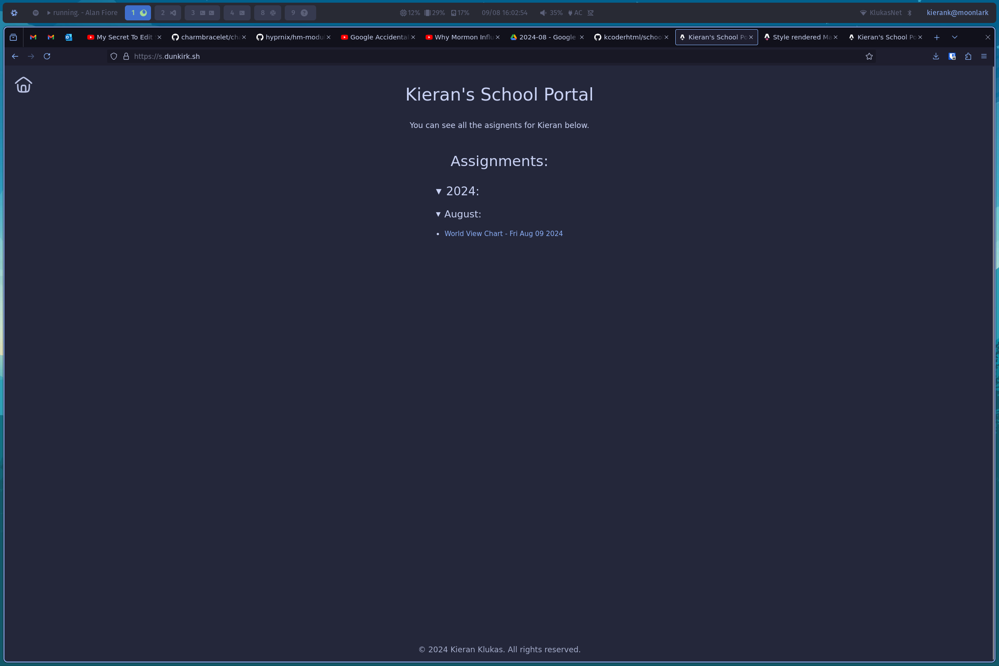

# School Portal

Such a generic name but such possiblities!!! Currently it just renders markdown assignments stuck into the src/content/a directory but i have hopeful plans for more soon

---

*© 2024 Kieran Klukas*  
*The code and design are licensed under [AGPL 3.0](LICENSE.md)*
*the assignments contained in the `src/content` directory have retained the full extent of copywrite protection as permited by law*